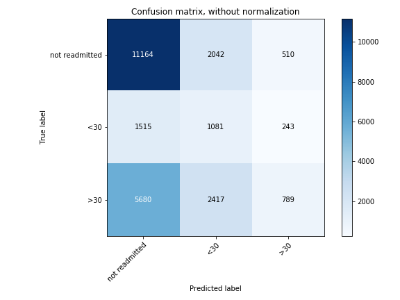
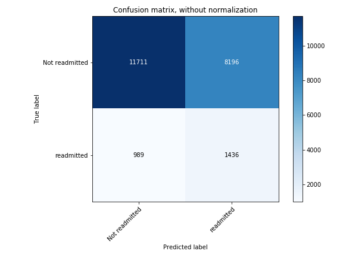
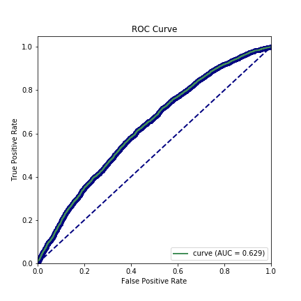

# Predicting hospital readmission for diabetic patients

# Objective
Predict if hospitalized diabetes patientscwill be readmitted into the hospital within 30 days. 

## Motivation
According to the [CDC](https://www.cdc.gov/media/releases/2017/p0718-diabetes-report.html) there are more than 100 million americans have diabetes of prediabetes. Acording to [Ostling et al.](https://clindiabetesendo.biomedcentral.com/articles/10.1186/s40842-016-0040-x), hospitalized patients that have diabetes mellitus have higher thirty day readmission rates (14.4-22.7%), than all other patients (8.5-13.5%) hospitalized.
Predicting if a patient will be readmitted within 30 days is not only important for the patients, but to the hospitals as well. There are progams such as the [Hospital Readmission Reduction Program](https://www.cms.gov/Medicare/Quality-Initiatives-Patient-Assessment-Instruments/Value-Based-Programs/HRRP/Hospital-Readmission-Reduction-Program.html) which lowers payments to hospitals with too many readmissions.

# Data
The data was downloaded from the [UCI Machine Learning Repository](https://archive.ics.uci.edu/ml/datasets/Diabetes+130-US+hospitals+for+years+1999-2008). The dataset consists of +100,000 patients admitted into a hospital and diagnosed with diabetes. The data was compiled from 130 US hospitals between 1998 and 2008.

The patients included in the dataset satisfy the following criteria:
    - The patients were diagnosed as diabetic
    - The patients stayed in the hospital between 1 and 14 days
    - Laboratory tests were performed during the encounter
    - Medications were administered during the encounter

The data contains 55 features including:
  - Race: one out of five categorical values
  - Gender 
  - Age: in 10 year bins
  - Weight: in pounds
  - Admission type: nine values (i.e. urgent or new born)
  - Discharge type: 29 values(i.e. home or expired) 
  - Admission source: 21 values (i.e. physician referral or emergency room)
  - Time in hospital: in days
  - Payer code: 23 possible values
  - Medical specialty: of the admitting physician, 84 values
  - Number of lab procedures: performed
  - Numper of procedures: (other than lab tests) performed
  - Number of medications administered: during the encounter
  - Number of outpatient and inpatient visits: in the year preceding the current encounter
  - Number of emergency visits: in the year preceding the current encounter
  - The three primary diagnosis codes (if applicable), more than 900 distinct values
  - Number of diagnosis: entered into the system
  - Glucose serum test result: >200, >300, normal or none
  - A1C test result: >7%, >8%, normal or none
  - 23 diabetic medications: with values of no, up, down, and steady
  - Change of diabetic medications 
  - Readmitted: patient was readmitted to hospital in less than 30day, more than 30 days or not readmitted.
  
For a full description of the features see references at the end of this page. 


# Base Model
Our first model was minimally cleaned
    - Dropped features that were not relevant to our prediction model like patient ID, and features had the same value across       all observations for all patients were also dropped.
    - Dropped columns with a a lot missing data: 97% of the data were missing weight, 49% were missing medical specialty.
    - Dropped the diagnosis column as we had +900 unique codes
    - Turned race, gender, medicines, admission, and discharges into categorical data types.
    
As an initial test we split the data into a train and test datasets, and ran AdaBoost, Logistic Regression, and Decision Tree models. The figure below shows the confusion matrix after fitting a Logistic Classifier on the training data and running it on the testing data. The accuracy of this model was 0.512.
    


The rest of the methods tested yielded similar results. In our previous experience fine tunning the model parameters would only improve accuracy marginally, instead of investigating different models and their parameter space, we decided to do some feature engineering to improve the resutls.

# Feature Engineering
The majority of the time spent on this project was on understanding the data and trying to find  the relevant features. With 55 features available in the data set, there are thousands of possible feature combinations. Instead of testing every possible combination (not realistic nor feasible) we engineered our features based on our review of various medical papers/studies. 

For our final model:
 - We dropped features that had: constant values  for all patients, that are irrelevant to our model, and if they had too many    values similar to our initial model. 
 - The target variable was changed to predict patients who will be readmitted in less than 30 dys. The target variable change according to the table below
 
 | Original Target Value | New Target Value  |
 | :---------------:|  :--------------:|
 | Not readmitted  |   0   |
 |  <30  |  1  |
 |  >30  |  0  |

- The 23 medicines dosage were summariazed into one variable, `dosage_up _down`. If the dosage of any medicine increased or decreased, we added or substacted a 1 the the variable. 
 - The 900+ diagnosis categories were binned into 9 different: Circulatory, Respiratory, Digestive, Diabetes, Injury, Musculoskeletal, Genitourinary, Neoplasma, or Other. We kept the primary diagnosis given, unless the second  diagnosis belonged to the same category as the third diagnosis. In those cases we kept the second diagnosis. 
 - Summed all the visits in the preceding year into a single feature
 - Summed the lab and non-lab procedures into a single feature
 - Created a new LAE index, defined as `L + A + E`, where: 
      - `L` if the length of stay in the hospital
      - `A` is the acuity of the admission, `A=3` for emergencies, and 0 otherwise
      - `E` is the number of emergency visits in the past year, maxed out at 4. 
 - The results of the glucose and the A1C tests were set to according to the table below:
 
 | Original Glucose Serum |New Glucose Serum || Original A1C results | New A1C results |
 | :--: | :---:  | --|:---: | :---: |
 | >300 | 3 | | >8 | 10 |
 | >200 | 1 | | >7 | 1 |
 | Norm | 0 | | Norm | 0 |
 | None | 0 | | None | 0 |

 - The age categories were grouped into three age groups: from 0 to 30 years old,  30 to 60 years old, and 60 to 100 years old
 - We also added a new columns identifying if a patient left the hospital against medical advice (LAMA)

# Results

After selecting these features, we dropped the patients that would not return because they either passed away in the hospital or were sent to hospice. This reduced our data set from 101763 patients down to 99340 patients. Out of those 99340, only 11314 patients were readmitted within 30 days. Since our data set is imbalanced, we stratified the train_test_split method in SciKit-Learn, to force the train and test data sets to have the same ratio of readmitted patients. 

```python
from sklearn.model_selectrion import train_test_split

X_train, X_test, y_trian, y_test = train_test_split(X, y, 
                        stratify=y, test_size=0.25, random_state=101
```
As the data was so unbalance we used whe Synthetic Minority Over-sampling Technique (SMOMTE) on our trian data, to create a new X_trian, and y_train, where 50% of the patients were readmitted, and 50% were not. We then used this synthetic data sets to train our models, and then validate them on the test datasetes. Note that the test datasets are still imbalanced. The code below shows how the training data was balanced

```python
from imblearn.over_sampling import SMOTE

sm = SMOTE(random_state=101)
X_sm_trian, y_sm_train = sm.fit_sample(X_train, y_train)
```

The next step was to optimize the parametes for the models tested. For that we created a pipeline for the three models, Adaboost, Logistic Regression and a Desicion Tree.

The figures below show the confusion matrix and the AUC curve for the Logistic Regression. The accuracy for this model was 0.59, and the AUC score was 0.629.




Finally we looked the features that have the highest impact on predicting the result

| Importance | Feature |
| :--: | :---: |
| 1* | Total number of visits |
| 2 | Type of discharge |
| 3* | LAE index |
| 4 | Number of diangosis |
| 5 | Diabetes Medicaiton |
|6* | Age grou 60 - 100 |

The * deontes the features we engineered for this analysis.


# Summary & future work
We created a model to predict the number if a patient diagnosed with Diabetes will be readmitted into a hospital within 30 days. To create our model, we engineered several features to help improve the prediction. Three of these engineered features show among the most important features (starred entries in the table above).  In this work, we balanced the trian data to have an equal number of readmitted patients and trained three models: Desicion Tree, AdaBoost and Logistic Regression. After a  Grid Search of the parameters we obtained our final model.  
While our model preforms better than our initial model using all the features available, there is plenty of room for improvement as we did not do an exhaustive tuning of the parameters.  After testing several other models, we came to the conclusion that more than testing new models, we need to focus on gaining more domain expertise. We need to better understand the features and how to interpret their different values.

# References

[UCI Machine Learning Repository](https://archive.ics.uci.edu/ml/datasets/Diabetes+130-US+hospitals+for+years+1999-2008)

[Impact of HbA1c Measurement on Hospital Readmission Rates: Analysis of 70,000 Clinical Database Patient Records. Strack et. al. BioMed Research International, Wol 2014, Art. ID 781679](http://dx.doi.org/10.1155/2014/781670)

